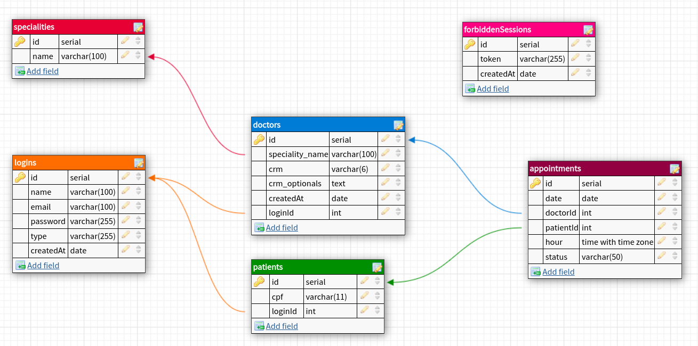

# <p align = "center">TypeMediCare API</p>

<p align = "center"></p>

<br>

## :white_circle: Technologies

- [bcrypt](https://www.npmjs.com/package/bcrypt)
- [cors](https://www.npmjs.com/package/cors)
- [dotenv](https://www.npmjs.com/package/dotenv)
- [express](https://expressjs.com/)
- [express-async-errors](https://www.npmjs.com/package/express-async-errors)
- [http-status](https://www.npmjs.com/package/http-status)
- [joi](https://joi.dev/)
- [jsonwebtoken](https://www.npmjs.com/package/jsonwebtoken)
- [pg](https://node-postgres.com/)
- [string-strip-html](https://www.npmjs.com/package/string-strip-html)

<br>

# 🏁 Let's go!

This project is an idea for a simple API whose purpose is to enable doctors and patients to interact through medical appointments. Doctors can create appointments, and patients can book them, including the ability to confirm and cancel. Patients can list all available (or unavailable) appointments and filter them by the doctor's specialization, date, hour, and even the doctor themselves. The stack primarily consists of TypeScript and Express for the back-end, and the data base was made using PostgreSQL. All the other technologies used in this project are listed above.  

```bash
git clone https://github.com/ecocaval/TypeMediCareAPI.git && cd TypeMediCareAPI
```

Then you must install all the dependencies running:

```bash
npx install
```

If you want to use and test the api you will have to recriate the database considering the tables that are showen in the database modeling, feel free to add improvements given the basis. To connect to the database create a .env file and populate it given the .env.example file:

```javascript
--Considering a local database--

PORT=               //the port to run your application
PGUSER=             //usually is postgres
PGPASSWORD=         //your password
PGHOST=             //usually is localhost
PGDATABASE=         //the name you give to the database
PGPORT=             //usually is 5432
NODE_ENV=           //dev || prod, prod activates SSL in db
JWT_PRIVATE_KEY=    //the key used in jwt.sign and jwt.verify
```


And finally, run:

```bash
npx node src/app.ts
```
